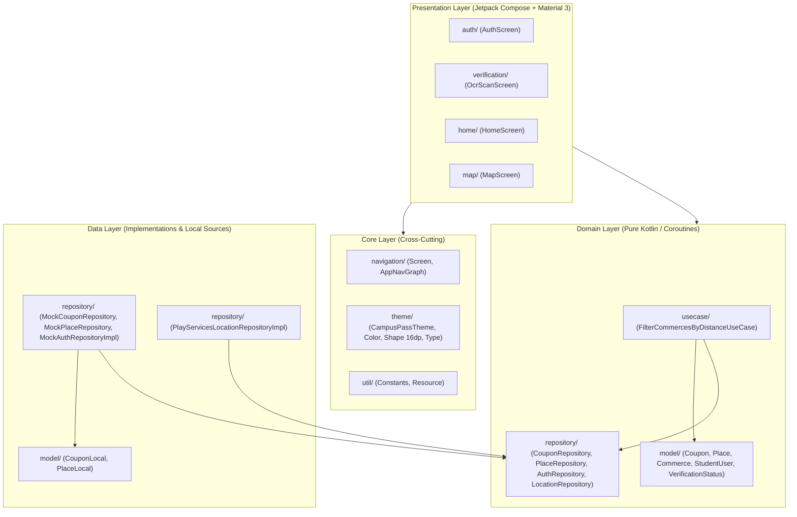

# Arquitectura del Sistema - CampusPass (EstudiHambres)

Documento arquitectónico basado en Clean Architecture y Jetpack Compose según las especificaciones de `PROJECT_RULES.md`.

---

## 1. Diagrama de Capas (Clean Architecture)



---

## 2. Estructura de Paquetes en `app/src/main/java/com/example/estudihambres/`

```
com.example.estudihambres/
│
├── core/                                 # Navegación, Tema y Utilidades transversales
│   ├── navigation/
│   │   ├── Screen.kt                     # Rutas: Home, Map, Auth, Verification
│   │   └── AppNavGraph.kt                # Scaffold + NavigationBar + NavHost
│   ├── theme/
│   │   ├── Color.kt                      # Paleta: #3344EE, #00C853, #FF6D00
│   │   ├── Shape.kt                      # RoundedCornerShape(16.dp)
│   │   ├── Type.kt                       # Material 3 Typography
│   │   └── Theme.kt                      # CampusPassTheme
│   └── util/
│       ├── Constants.kt                  # Radio máximo 30 km, radio terrestre
│       └── Resource.kt                   # Envoltorio de estados (Success, Error, Loading)
│
├── data/                                 # Modelos locales y repositorios mock
│   ├── model/
│   │   ├── CouponLocal.kt                # Modelo local con mapper .toDomain()
│   │   └── PlaceLocal.kt                 # Modelo local con mapper .toDomain()
│   └── repository/
│       ├── MockCouponRepository.kt       # Repositorio mock de cupones
│       ├── MockPlaceRepository.kt        # Repositorio mock de lugares
│       ├── MockAuthRepositoryImpl.kt     # Repositorio mock de sesión/carnet
│       ├── MockCommerceRepositoryImpl.kt # Comercios mock para pruebas
│       └── PlayServicesLocationRepositoryImpl.kt # FusedLocationProviderClient
│
├── domain/                               # Modelos de entidad y casos de uso
│   ├── model/
│   │   ├── Coupon.kt                     # Entidad de cupón
│   │   ├── Place.kt                      # Entidad de lugar/comercio
│   │   ├── Commerce.kt                   # Entidad comercial ampliada
│   │   ├── StudentUser.kt                # Entidad del estudiante
│   │   └── VerificationStatus.kt         # Enum (VERIFIED, PENDING_VERIFICATION, etc.)
│   ├── repository/
│   │   ├── CouponRepository.kt           # Interfaz de cupones
│   │   ├── PlaceRepository.kt            # Interfaz de lugares
│   │   ├── CommerceRepository.kt         # Interfaz de comercios
│   │   ├── AuthRepository.kt             # Interfaz de autenticación
│   │   └── LocationRepository.kt         # Interfaz de geolocalización
│   └── usecase/
│       └── FilterCommercesByDistanceUseCase.kt # Lógica Haversine (radio <= 30 km)
│
└── presentation/                         # Submódulos de interfaz de usuario
    ├── auth/
    │   └── AuthScreen.kt                 # Ingreso con correo institucional y DNI
    ├── verification/
    │   └── OcrScanScreen.kt              # Escaneo de carnet con opción de omitir
    ├── home/
    │   └── HomeScreen.kt                 # Pantalla principal con anuncios y bienvenida
    └── map/
        └── MapScreen.kt                  # Pantalla de mapa y geolocalización
```

---

## 3. Estado de los Módulos

| Módulo / Agente | Estado | Descripción |
|---|---|---|
| **Agente 1: Arquitectura** | ✅ Configurado | Separación estricta en `core/`, `data/`, `domain/`, `presentation/`. |
| **Agente 2: UI/UX & Compose** | ✅ Configurado | Material 3, `NavigationBar`, `Scaffold`, paleta corporativa y tarjetas redondeadas a 16.dp. |
| **Agente 3: Auth & OCR** | ⏳ Base lista | Dependencia `play-services-mlkit-text-recognition` configurada; `AuthScreen` y `OcrScanScreen` preparadas. |
| **Agente 4: Geolocalización** | ⏳ Base lista | Dependencias `maps-compose` y `play-services-location` agregadas; permisos en manifest y `MapScreen` listo. |
| **Agente 5: QA & Pruebas** | ✅ Activo | Pruebas unitarias de distancia Haversine y filtro de 30 km aprobadas. |
| **Agente 6: GitFlow & Release Manager** | ✅ Verificado | Rama `feature/setup-dependencies-and-navigation` compila sin errores y genera `app-debug.apk`. |
